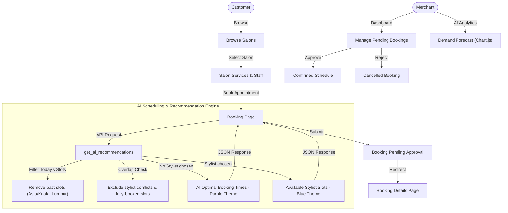

# 💇‍♂️ AI-Based Online Service Booking and Scheduling System

> **Final Year Project 2**  
> An intelligent, multi-tenant SaaS application that optimizes salon scheduling and provides demand analytics using artificial intelligence.

---

## 📌 Project Overview

This project is an **AI-Based Online Service Booking and Scheduling System** designed for hair salons. It optimizes the scheduling process by using intelligent recommendation algorithms to suggest the best timeslots to customers. It also equips salon owners (merchants) with forecasting charts showing customer traffic demand to improve staff scheduling and business planning.

The project features a clean, responsive layout built on top of **Django** and **Bootstrap 5**, featuring dedicated portals for customers and merchants.

---

## 🔄 System Architecture



---

## ✨ Key Features

### 👤 Customer Portal
*   **Browse Salons & Stylists**: View details of available salons, services, stylist rosters, and reviews.
*   **Intelligent Booking**:
    *   **Auto-Filter Today's Slots**: Automatically hides past hours when booking for the current day.
    *   **Stylist Availability Logic**: Checks for overlapping appointments to ensure double-booking does not occur.
    *   **Dynamic UI Themes**:
        *   **Auto Arrange**: Selecting no stylist unlocks **AI Optimal Booking Times** (styled in a purple-accented layout showing the top 3 recommended slots to avoid peak hours).
        *   **Specific Stylist**: Displays **Available Time Slots** (styled in a blue-accented layout showing all free slots for that stylist).
*   **Immediate Booking Details**: Redirects customers to a structured, premium **Booking Details** page upon booking completion.
*   **Appointment Management**: Clear overview of booked appointments and the ability to cancel bookings directly.

### 🏢 Merchant Portal
*   **Live Dashboard**: Overview of key business performance indices (Total Team Staff, Services, Total Bookings, and Pending Bookings).
*   **AI Demand Forecasting**: Real-time line chart predicting customer load over business hours (10:00 AM - 07:00 PM) for the next 24 hours.
*   **Service Analytics**: Doughnut chart illustrating the popularity distribution of different salon services.
*   **Booking Management**: Approve pending booking requests or cancel existing confirmed reservations.
*   **Team & Service Management**: Dynamically add and update services (with duration & price notes) and staff profiles (with role & specialty tags).

---

## 🛠️ Technology Stack

*   **Backend**: Python, Django 4.x / 5.x
*   **Database**: SQLite
*   **Frontend**: Vanilla HTML5, CSS3, Bootstrap 5.3, Bootstrap Icons, Chart.js
*   **Timezone Handling**: Timezone-aware filtering matching the localized timezone (`Asia/Kuala_Lumpur`).

---

## 📁 Key File Structure

```text
HairSalon/
│
├── HairSalon/                   # Project configurations & settings
│   ├── settings.py
│   └── urls.py
│
├── services/                    # Core business logic app
│   ├── templates/services/      # HTML templates
│   │   ├── base.html            # Global base template
│   │   ├── create_booking.html  # Dynamic booking template
│   │   ├── booking_detail.html  # Booking detail page
│   │   ├── dashboard.html       # Merchant analytics dashboard
│   │   └── my_bookings.html     # Customer appointments list
│   │
│   ├── ai_logic.py              # AI scheduling optimization logic
│   ├── models.py                # Database schema
│   ├── tests.py                 # Automated unit tests
│   ├── urls.py                  # App routes
│   └── views.py                 # API controllers and views
│
├── manage.py                    # Django CLI management script
├── haircut_ai_model.pkl         # Trained model for demand prediction
└── haircut_demand.csv           # Historical training data
```

---

## 🚀 Getting Started

### 1. Clone the Repository
```bash
git clone https://github.com/kh1683/AI-based-Online-Service-Booking-and-Scheduling-System.git
cd AI-based-Online-Service-Booking-and-Scheduling-System/HairSalon
```

### 2. Set Up Virtual Environment & Dependencies
```bash
# Create virtual environment
python -m venv venv

# Activate virtual environment
# On Windows:
venv\Scripts\activate
# On macOS/Linux:
source venv/bin/activate

# Install Django and dependencies
pip install django pillow
```

### 3. Run Database Migrations
```bash
python manage.py migrate
```

### 4. Run the Development Server
```bash
python manage.py runserver
```
Visit the local server in your browser: `http://127.0.0.1:8000/`.

---

## 🧪 Running Tests

To verify that scheduling algorithms, availability logic, and details page routing are functioning properly:
```bash
python manage.py test
```
